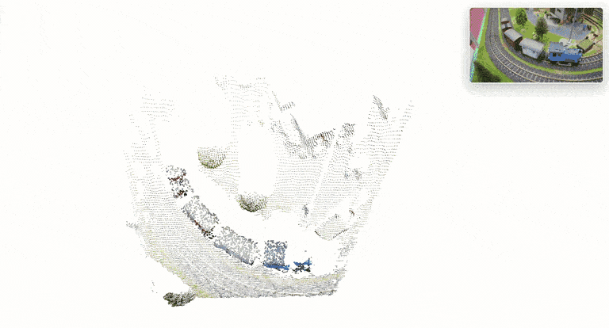

<div align="center">
<h1>UniQuery4R: Unified 4D Scene Reconstruction from a Single Query</h1>

<a href="https://arxiv.org/abs/2608.17283"></a>
<a href="https://kosmoresearch.github.io/UniQuery4R/"></a>
<a href="https://huggingface.co/Kosmo-Research/UniQuery4R"></a>
<a href="https://github.com/KosmoResearch/UniQuery4R"></a>
<a href="LICENSE"></a>

<br>
<br>

<strong>
<sub>
Tiancheng Chen<sup>1</sup>
&nbsp;&nbsp;
Sheng Tang<sup>1</sup>
&nbsp;&nbsp;
Wenhua Jin<sup>1,2</sup>
&nbsp;&nbsp;
Weiqi Zhang<sup>3</sup>
&nbsp;&nbsp;
Juntong Fang<sup>3</sup>
&nbsp;&nbsp;
Junsheng Zhou<sup>3</sup>
&nbsp;&nbsp;
Zesong Li<sup>1</sup>
</sub>
<br>
<br>
<sub>
<sup>1</sup>Kosmo Research&nbsp;&nbsp;
<sup>2</sup>Automotive Engineering Department, Jilin University&nbsp;&nbsp;
<sup>3</sup>School of Software, Tsinghua University
</sub>
</strong>



</div>

## Overview

**UniQuery4R** is a query-conditioned feed-forward framework for unified 4D scene reconstruction from a single query. A variable-length multi-view clip is jointly encoded **once**; at decoding time, a continuous source-pixel query `q = (u, v, src, tgt)` selects the source and target views via source-to-target cross-attention — no learned temporal embeddings tied to a fixed clip length, and no recomputation per frame pair.

Each query jointly predicts:

- **Target correspondence** (`warp2d`) — where the source pixel lands in the target view,
- **Target-time 3D position** (`warp3d`) — the 3D point at target-frame time,
- **Scene flow** (`warp3d_delta`) — parameterized as direction × magnitude, with separate supervision for moving and static points,
- **Source depth**,

while **camera parameters are estimated per view** (extrinsics / intrinsics).

Because the encoded clip is reused across arbitrary source–target selections, the same model serves both sparse inference (a handful of queried points) and dense reconstruction (batched queries over a UV grid).

## News

- **[2026-09]** Code and model inference scripts released.

## Installation

```bash
git clone https://github.com/kosmoresearch/UniQuery4R.git
cd UniQuery4R

conda create -n uniquery4r python=3.10 -y
conda activate uniquery4r

# PyTorch (adjust the CUDA version to your driver)
pip install torch>=2.4 torchvision --index-url https://download.pytorch.org/whl/cu121

pip install -r requirements.txt
# or, with the optional extras (viser viewer / HF hub download):
pip install -e ".[all]"
```

## Model Checkpoints

| Model | Params | Checkpoint |
| --- | --- | --- |
| UniQuery4R | ViT-g encoder | [Hugging Face `Kosmo-Research/UniQuery4R`](https://huggingface.co/Kosmo-Research/UniQuery4R) |

`--checkpoint` accepts either a local `state_dict` file or a Hugging Face repo id; repo ids are downloaded automatically (requires `huggingface_hub`):

```bash
# local file
--checkpoint /path/to/ckpt.pth
# Hugging Face (downloads uniquery4r.pth from the repo)
--checkpoint Kosmo-Research/UniQuery4R
```

## Quick Start

### 1. 4D reconstruction and export

Reconstruct per-view geometry, cameras and motion from an image sequence, and export a fused point cloud overlaid with camera frustums. By default the script runs on the bundled 20-frame DAVIS sample in `samples/rollerblade/`; pass `--input path/to/images` to use your own sequence (file, dir, or glob):

```bash
python scripts/infer_4d.py \
    --checkpoint Kosmo-Research/UniQuery4R \
    --output outputs/demo
```

Outputs:

```
outputs/demo/
├── scene.glb          # fused colored point cloud + camera frustums (drag & drop into a viewer)
├── scene.ply          # point cloud
├── cameras.ply        # camera frustum meshes
└── predictions.npz    # raw tensors + scene-flow tracks (input for scripts/view_4d.py; --no-npz to skip)
```

Useful flags: `--points-from warp3d` (export the `warp3d` head points instead of unprojected depth), `--max-frames`, `--max-size`, `--chunk-size`, `--conf-thresh`.

`--chunk-size` (default 30000) trades GPU memory for speed in the dense query decoder. Peak per-process GPU memory measured at 504 px on a single NVIDIA A800-80GB (PyTorch 2.5.1), with the bundled 20-frame sample and a 100-frame clip (DAVIS `parkour`):

| `--chunk-size` | 20 frames | 100 frames |
| --- | --- | --- |
| 5000 | 14.2 GB | 32.2 GB |
| 10000 | 16.4 GB | 45.5 GB |
| 20000 | 21.2 GB | 70.2 GB |
| 30000 (default) | 25.7 GB | OOM |
| 40000 | 30.1 GB | OOM |
| 50000 | 34.6 GB | OOM |

Memory grows roughly linearly with both `--chunk-size` and the number of frames: a 100-frame clip does not fit in 80 GB at the default 30000. If inference runs out of GPU memory (OOM), lower `--chunk-size` (e.g. `--chunk-size 10000`) to reduce peak memory usage; raise it for higher throughput.

Configure it directly on the inference command line:

```bash
python scripts/infer_4d.py \
    --checkpoint Kosmo-Research/UniQuery4R \
    --output outputs/demo \
    --chunk-size 10000
```

`scripts/infer_motion_mask.py` takes the same flag; in the Python API, pass `chunk_size` to the `UniQuery4R(...)` constructor.

### 2. Motion masks

Compute per-frame moving-object masks from the predicted scene-flow magnitude, with overlay PNGs and a GIF:

```bash
python scripts/infer_motion_mask.py \
    --checkpoint Kosmo-Research/UniQuery4R \
    --output outputs/motion
```

### 3. Interactive scene-flow viewer

Viewing is separate from inference: the viewer reads `predictions.npz` from an output directory, so it can be launched (or re-launched) at any time after step 1:

```bash
python scripts/view_4d.py --input outputs/demo --port 8080
```

Opens a [viser](https://github.com/nerfstudio-project/viser) viewer with per-query motion trails and a moving point cloud (requires the `viz` extra; camera frustums are hidden by default, `--show-cameras` to show them).

## Python API

```python
import numpy as np
import torch

from uniquery4r.models.uniquery4r import UniQuery4R
from uniquery4r.utils.geometry import unproject_depth_map_to_point_map
from uniquery4r.utils.hub import resolve_checkpoint
from uniquery4r.utils.load_fn import collect_image_paths, load_and_preprocess_images

paths = collect_image_paths("path/to/images")
images = load_and_preprocess_images(paths).to("cuda")       # [S, 3, H, W] in [0, 1]

model = UniQuery4R().eval()
model.load_checkpoint(resolve_checkpoint("Kosmo-Research/UniQuery4R"))
model = model.to("cuda")

with torch.inference_mode():
    predictions = model(images)   # dense UV-grid queries; pass query_uv=[Q,2] for sparse queries

extrinsic, intrinsic = predictions["extrinsic"][0], predictions["intrinsic"][0]   # [S,3,4], [S,3,3]
depth = predictions["depth"][0][:, 0]                                             # [S,H,W]
points = unproject_depth_map_to_point_map(
    depth.cpu().numpy(), extrinsic.cpu().numpy(), intrinsic.cpu().numpy(),
)                                                                                 # [S,H,W,3]
```

`predictions` also contains the per-pair motion outputs (`warp2d`, `warp3d`, `warp3d_delta_direction`, `warp3d_delta_magnitude`) indexed by `pair_idx = [(0, i)] + [(i, i)]`, where self-pairs `(i, i)` carry per-view geometry and cross pairs `(0, t)` carry frame-0 → frame-t motion. For sparse tracking, pass `query_uv` with the source-pixel coordinates you care about:

```python
query_uv = torch.tensor([[u0, v0], [u1, v1]], device="cuda")   # pixel units, image 0
predictions = model(images, query_uv=query_uv)
```

## Evaluation on WorldTrack

We evaluate **dynamic point tracking** on [WorldTrack](https://github.com/princeton-vl/WorldTrack): given points queried in frame 0, predict their 3D positions in later frames (scene-flow EPE) and their 3D trajectories in the frame-0 reference world coordinates (dynamic-point reconstruction).

Metrics:

| Metric | Meaning |
| --- | --- |
| **APD** ↑ | average percentage of dynamic points within a distance threshold of the GT trajectory (`avg_pts_global`) |
| **τ@0.1m** ↑ | fraction of tracked points within 0.1 m of GT (`tau_global`) |
| **EPE** ↓ | 3D end-point error after global scale alignment, meters (`epe_global`) |

### Results (WorldTrack dynamic point tracking, macro average)

| Method | APD ↑ | EPE ↓ (m) |
| --- | --- | --- |
| SpatialTrackerV2 | 56.78 | 0.4236 |
| St4RTrack | 71.33 | 0.2793 |
| TraceAnything | 61.70 | 0.5350 |
| Any4D | 73.88 | 0.2996 |
| V-DPM | 80.13 | 0.1944 |
| 4RC | 79.43 | 0.2095 |
| OpenD4RT | 72.84 | 0.2646 |
| **UniQuery4R** | **83.89** | **0.1601** |

Per-dataset breakdown of UniQuery4R:

| Dataset | PStudio | PointOdyssey | Dynamic Replica | Aria Digital Twin |
| --- | --- | --- | --- | --- |
| APD ↑ | 84.64 | 83.74 | 80.00 | 87.17 |
| EPE ↓ (m) | 0.1333 | 0.1604 | 0.2078 | 0.1387 |

## Acknowledgements

UniQuery4R builds on excellent open-source projects:

- [VGGT](https://github.com/facebookresearch/vggt) — transformer blocks, camera head, pose encoding and rotation utilities (`uniquery4r/models/layers`, `uniquery4r/models/heads/camera_head.py`, `uniquery4r/utils/pose_enc.py`).
- [Depth Anything 3](https://github.com/ByteDance-Seed/Depth-Anything-3) and [DINOv2](https://github.com/facebookresearch/dinov2) — the ViT-g multi-view encoder.
- [viser](https://github.com/nerfstudio-project/viser) — interactive scene-flow viewer.
- [trimesh](https://github.com/mikedh/trimesh) — GLB/PLY export.
- The evaluation follows the WorldTrack dynamic-point-tracking protocol (Open-d4rt / TapVid3D layout).
- We thank the authors of [Any4D](https://github.com/Any-4D/Any4D), [V-DPM](https://github.com/eldar/vdpm), [4RC](https://github.com/Luo-Yihang/4RC) and [OpenD4RT](https://github.com/Lijiaxin0111/Open-d4rt) for making their code publicly available.

## Citation

If you find this work useful, please cite:

```bibtex
@article{chen2026uniquery4r,
  title={{UniQuery4R}: Unified {4D} Scene Reconstruction from a Single Query},
  author={Chen, Tiancheng and Tang, Sheng and Jin, Wenhua and Zhang, Weiqi and Fang, Juntong and Zhou, Junsheng and Li, Zesong},
  journal={arXiv preprint arXiv:2608.17283},
  year={2026}
}
```

## License

This repository is released under the [Apache License 2.0](LICENSE). Files adapted from VGGT remain under the [VGGT License](licenses/VGGT-LICENSE.txt) (non-commercial); see [NOTICE](NOTICE) for details.
